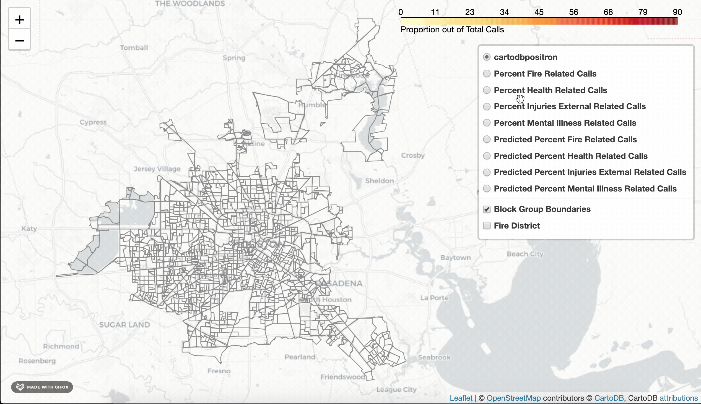

# HFD_Spring_2020
Team Houston Fire Department \
DSCI 435 Spring 2020 \
Rice University 

### Description 
 

This is the repository for Team HFD's entire project. This set of scripts form a complete data science pipeline to create a general Risk Assessment and covid-19 risk assessment of Houston.

#### Methods Used 
- Time Series Decomposition
- Chi-squared tests
- Mann-Kendall trend test
- Light Gradient Boosting Model
- K-means clustering 

#### Technologies Used 
- Python 
   - NumPy/pandas
   - matplotlib 
   - scikit-learn
   - seaborn
   - folium 
- R 
   - NBClust 
   - Clustree

---
## Documentation 
[Full Report](https://drive.google.com/file/d/1lHDojuRc_ST6w6Wpj1SJOviPhoVKFqMl/view?usp=sharing)

### D2K Showcase 2020: Covid-19 Risk Assessment 
**People's Choice Winner**

[1 Minute Presentation Video](https://www.youtube.com/watch?v=amsAb2AAe24) \
[5 Minute Presentation Video](https://rice.app.box.com/s/qoxwjch1cir9ggsjkea5wj91gqmauir7)

---
## Getting Started 
Before getting started, make sure you are using at least conda version 3.8.2. 

### Set up virtual Environment
Follow the bellow instructions or copy and paste the commandline prompts under instructions
1. clone repo\
   `$ git clone https://github.com/cmm16/hfd-spring-2020.git;`\
  or if using ssh\
  `$ git clone git@github.com:cmm16/hfd-spring-2020.git;`
2. cd into base of project directory\
   `$ cd hfd-spring-2020;`
3. Prepare virtual environment\
  `$ conda env create --file environment.yml`\
  `$ source activate env`

To deactivate the environment, type `$ conda deactivate`
   
### Download Data
Got to project box and download Data folder move to top level of this project\
The path to the data folder should now be "hfd-spring-2020/Data"

Unzip folder and make sure all contents go into folder called Data\
(on linux `unzip Data.zip`)

### Run
To run whole project (will take a lot of time)\
For mac use: `$ python $PWD;`\
For windows use: `$ python %cd%;`

To run project but skip spatial join (saves time)\
For mac use: `$ python $PWD --skip True;`\
For windows use: `$ python %cd% --skip True;`

After running the project, you can find general risk assessment outputs in "hfd-spring-2020/eda_output" and covid risk assessment outputs in "hfd-spring-20202/covid_output". 

---
### Members

- Melinda Ding 
- Nick Falkenberg
- Neyda Mami 
- Cole Morgan
- Ohifeme Longe
- Emre Yurtbay
